# Loans-Mortgages-ELT-Pipeline

This repository demonstrates a robust ELT (Extract, Load, Transform) data pipeline designed for processing loan and mortgage data. The pipeline showcases integration between several modern data engineering technologies: PostgreSQL, Apache NiFi, HDFS, Apache Hive, Apache Spark, and Apache Airflow. This document provides a comprehensive guide to the pipeline architecture, technology stack, environment setup, and operational workflow.

---

## Table of Contents

- [Overview](#overview)
- [Pipeline Architecture](#architecture)
- [Technology Stack](#technology-stack)
- [Pipeline Workflow](#pipeline-workflow)
- [Setup and Environment](#setup-and-environment)
- [Directory Structure](#directory-structure)
- [How to Run](#how-to-run)
- [Configuration](#configuration)
- [Monitoring & Orchestration](#monitoring--orchestration)
- [Extensibility](#extensibility)
- [Troubleshooting](#troubleshooting)
- [Contributing](#contributing)
- [License](#license)

---


## Overview

This project implements an end-to-end ELT pipeline for the analysis of loans and mortgages data. The pipeline demonstrates how raw data can be extracted from a relational database, loaded into a distributed file system, transformed using big data tools, and finally stored in a data warehouse for advanced querying and analytics.

**Key Features:**
- Automated data ingestion from PostgreSQL
- Scalable data movement via Apache NiFi
- Distributed storage using HDFS
- Data transformation with Apache Spark
- Data warehousing in Apache Hive
- Workflow orchestration and automation using Apache Airflow

---

## Architecture


---

## Technology Stack

| Layer                | Technology          | Role / Purpose                   |
|----------------------|--------------------|----------------------------------|
| Data Source          | PostgreSQL         | Stores raw transactional data    |
| Data Ingestion       | Apache NiFi        | ETL automation, data movement    |
| Storage              | Hadoop HDFS               | Distributed file system          |
| Data Processing      | Apache Spark       | Data transformation (ELT)        |
| Data Warehouse       | Apache Hive        | Structured storage, SQL queries  |
| Orchestration        | Apache Airflow     | Workflow scheduling and monitoring|
| Containerization     | Docker             | Environment isolation            |
| Visualizations       | Metabase           | Visualizing Data Into Useful Insights            |

---


## How to Run

1. **Clone the Repository**
   ```bash
   git clone https://github.com/nasr1231/Loans-Mortgages-ELT-Pipeline.git
   cd Loans-Mortgages-ELT-Pipeline
   ```

2. **Start All Services**
   ```bash
   docker-compose up -d
   ```
   This command will launch all containers for HDFS, YARN, Airflow, Spark, Hive, Zeppelin, and supporting services.

3. **Check Initialization**
   - Airflow initialization happens via the `airflow-init` service. Wait for this to become healthy before accessing other components.
   - You can check container health and logs with:
     ```bash
     docker ps
     docker logs <container_name>
     ```

---

## Tools & Web UIs

| Tool/Service     | UI Port | Default URL                       | Container Name        |
|------------------|--------:|-----------------------------------|----------------------|
| Airflow          |   3000  | http://localhost:3000             | ELT_Loan_namenode     |
| Spark Master     |   8080  | http://localhost:8080             | ELT_Loan_namenode     |
| Spark Worker     |   8081  | http://localhost:8081             | ELT_Loan_namenode     |
| Spark Driver     |   4040  | http://localhost:4040             | ELT_Loan_namenode     |
| Zeppelin         |   8082  | http://localhost:8082             | ELT_Loan_namenode     |
| HDFS Namenode    |   9870  | http://localhost:9870             | ELT_Loan_namenode     |
| PostgreSQL       |   5432  | N/A (access via client/psql)      | external_postgres_db  |
| Airflow Init     |   N/A   | N/A (background setup)            | ELT_Loan_airflow-init |
| HDFS Datanode    |   N/A   | N/A                               | ELT_Loan_datanode     |

---

## Important Notes

- **Initialization**: The Airflow service is initialized via the `airflow-init` container. Do not access Airflow UI until this process is complete.
- **Dependencies**: Several services depend on the external PostgreSQL service and must wait until it is ready. Health checks ensure proper boot order.
- **Persistent Data**: Hadoop, Airflow, Spark, and Zeppelin data are persisted via Docker volumes; container restarts will not lose pipeline state.
- **Configuration Files**: Custom configs (for Hive, Zeppelin, Flume, Airflow, etc.) are mapped via Docker volumes from the local `configs/` directory.
- **Default Credentials**: Airflow admin user is created with username `admin` and password `admin`. Change these for production deployments.
- **Resource Use**: Running all services may require substantial RAM and CPU. Adjust Docker resource limits as needed.
- **Service Ports**: If you have other local services using these ports, you may need to change the mappings in `docker-compose.yaml`.
- **Logs & Debugging**: Use `docker logs <container_name>` and the respective web UIs for monitoring and troubleshooting errors.

---

> **See the full [docker-compose.yaml](https://github.com/nasr1231/Loans-Mortgages-ELT-Pipeline/blob/main/docker-compose.yaml) for complete details on service configuration.**

## Data Modeling: Fact and Dimension Tables

The pipeline is built using a star schema modeling approach, which organizes loan and mortgage data into fact and dimension tables:

- **Fact Table (`fact_loans`)**:  
  Stores transactional records for loans and mortgages, including details like loan amount, interest rate, applicant, and approval date. Each row represents a single loan/mortgage event.

- **Dimension Tables**:
  - `Dim_Borrowers`: Contains borrower demographic and financial profile information, such as employment, income, home ownership, and application type.
  - `Dim_Credit_Grade`: Defines the credit grade and sub-grade classifications associated with each loan, supporting credit risk analysis.
  - `Dim_Loan_Term`: Describes the term details for loans, including period and term descriptions, enabling product-based segmentation.
  - `Dim_Status`: Categorizes loan statuses (current, late, default, etc.) and status groups for lifecycle and performance reporting.
  - `Dim_Date`: Calendar table providing detailed date breakdowns (year, month, quarter) for time-based analytics, such as loan issuance, payment schedules, and credit pulls.

```mermaid
erDiagram
    FACT_LOANS {
      BIGINT loan_id_pk_sk
      BIGINT loan_id_bk
      BIGINT status_id_fk
      BIGINT borrowers_id_fk
      BIGINT date_issue_fk
      BIGINT date_last_payement_fk
      BIGINT date_next_payment_fk
      BIGINT last_credit_pull_date
      BIGINT Credit_grade_fk
      BIGINT loan_term_fk
      DECIMAL loan_amount
      DECIMAL dti
      DECIMAL Installment
      DECIMAL interest_rate
      DECIMAL total_payment
      STRING purpose
      TIMESTAMP insert_date       
    }
    Dim_Borrowers {
      BIGINT borrowers_id_sk
      BIGINT borrowers_id_bk
      STRING emp_title
      STRING employment_length
      DECIMAL annual_income
      STRING home_ownership 
      STRING state_code 
      INT total_account 
      STRING verification_status 
      STRING application_type 
      TIMESTAMP insert_date 
    }
    Dim_Date {
      BIGINT date_key 
      DATE Date
      INT year 
      INT month 
      STRING month_name 
      INT quarter 
      TIMESTAMP insert_date 
    }
    Dim_Status {
      BIGINT status_id_sk 
      STRING loan_status 
      STRING loan_status_category 
      TIMESTAMP insert_date 
    }
    Dim_Credit_Grade {
      BIGINT Credit_grade_sk
      STRING Grade 
      STRING Sub_grade 
      TIMESTAMP insert_date
    }
    Dim_Loan_Term {
      BIGINT Loan_Term_sk 
      STRING Period 
      STRING Term_description 
      TIMESTAMP insert_date 
    }
    FACT_LOANS ||--o{ Dim_Borrowers: "borrowers_id_fk"
    FACT_LOANS ||--o{ Dim_Status: "status_id_sk"
    FACT_LOANS ||--o{ Dim_Loan_Term: "Loan_Term_sk"
    FACT_LOANS ||--o{ Dim_Date: "date_issue_fk"
    FACT_LOANS ||--o{ Dim_Date: "date_last_payement_fk"
    FACT_LOANS ||--o{ Dim_Date: "date_next_payment_fk"
    FACT_LOANS ||--o{ Dim_Date: "last_credit_pull_date"
    FACT_LOANS ||--o{ Dim_Credit_Grade: "Credit_grade_sk"
```



---

### Notes

- **Surrogate Keys (`_sk`)**: Used for data warehouse uniqueness, independent of source system updates.
- **Business Keys (`_bk`)**: Reference original IDs from the source transactional system.
- **Foreign Keys (`_fk`)**: Maintain relationships between fact and dimension tables.
- **External Tables**: Data is managed outside Hive, making it easier to reload or archive.
- **ORC Format**: Chosen for efficient storage and query performance.
- **Partitioning**: For large tables, consider partitioning by date or status for faster queries.

---

> For full DDLs, see: [Hive Data Warehouse DDL Script](scripts/Hive-DWH-DDL.sql)  
