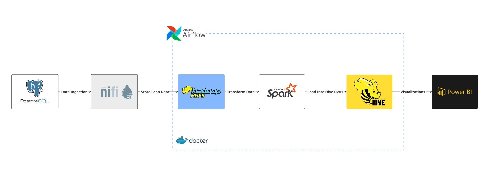
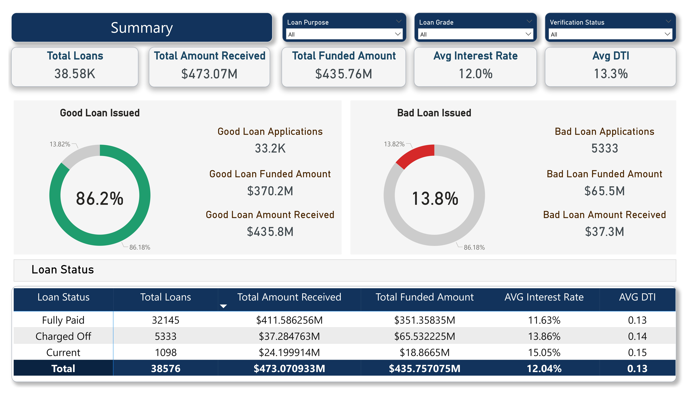
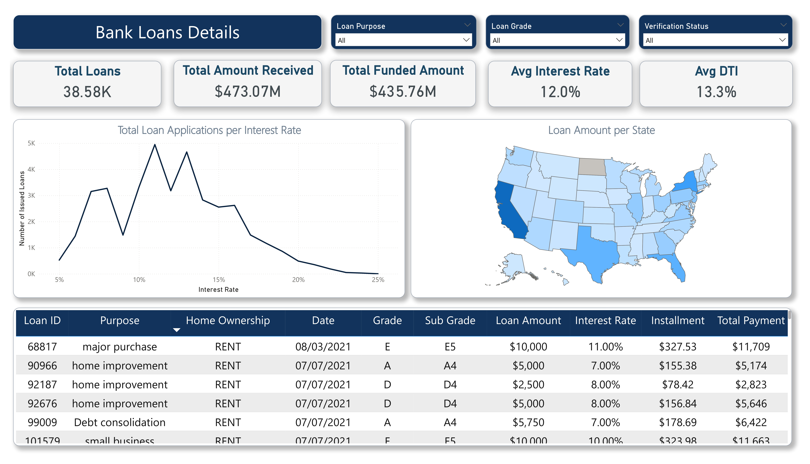
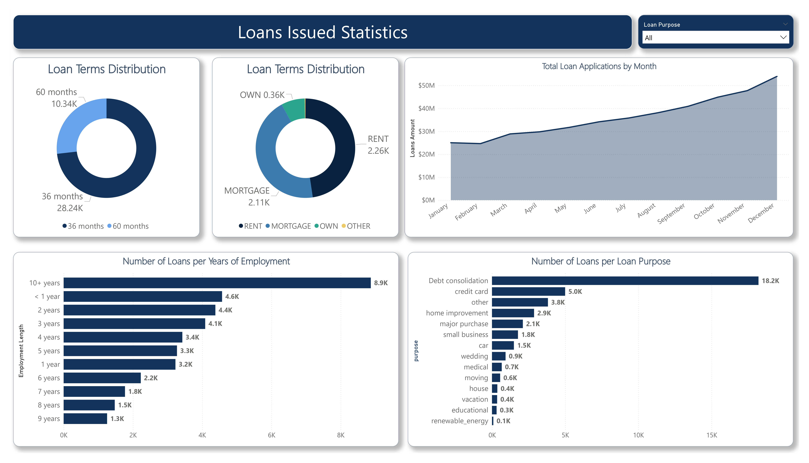
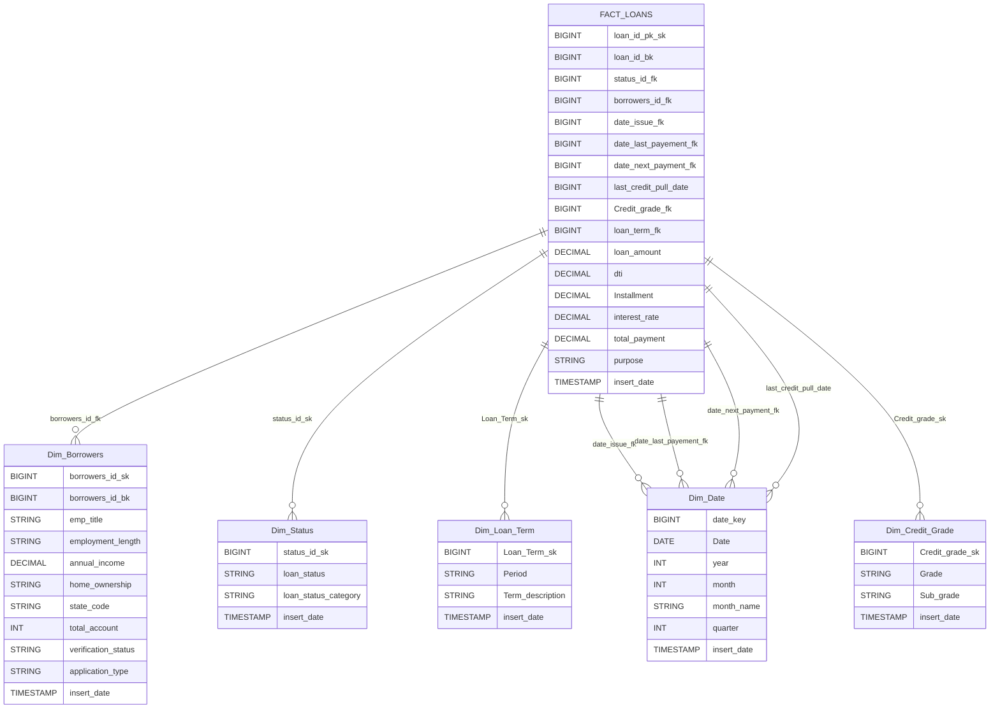

# Loans-Mortgages-ELT-Pipeline

This repository demonstrates a robust ELT (Extract, Load, Transform) data pipeline designed for processing loan and mortgage data. The pipeline showcases integration between several modern data engineering technologies: PostgreSQL, Apache NiFi, HDFS, Apache Hive, Apache Spark, and Apache Airflow. This document provides a comprehensive guide to the pipeline architecture, technology stack, environment setup, and operational workflow.

---

## 📑 Table of Contents

1. [Overview](#1-overview)  
2. [Architecture](#2-architecture)  
3. [Dashboard Preview](#3-dashboard-preview)  
4. [Technology Stack](#4-technology-stack)  
5. [How to Run](#5-how-to-run)  
6. [Data Ingestion: From Relational Database to HDFS](#6-data-ingestion-from-relational-database-to-hdfs)  
7. [Configuring the HDFS Staging Layer](#7-configuring-the-hdfs-staging-layer)  
8. [Spark Transformation: Data Processing in the Pipeline](#8-spark-transformation-data-processing-in-the-pipeline)  
9. [Hive Data Warehouse: My Implementation](#9-hive-data-warehouse-my-implementation)  
10. [Airflow Orchestration](#10-airflow-orchestration)
11. [Explanation of Terms Used in the Report](#10-explanation-of-terms-used-in-the-report)
---


## 1-Overview

This project implements an end-to-end ELT pipeline for the analysis of loans and mortgages data. The pipeline demonstrates how raw data can be extracted from a relational database, loaded into a distributed file system, transformed using big data tools, and finally stored in a data warehouse for advanced querying and analytics.

**Key Features:**
- Automated data ingestion from PostgreSQL
- Scalable data movement via Apache NiFi
- Distributed storage using HDFS
- Data transformation with Apache Spark
- Data warehousing in Apache Hive
- Workflow orchestration and automation using Apache Airflow

---

## 2-Architecture



---

## 3-Dashboard Preview





---

## 4-Technology Stack

| Layer                | Technology          | Role / Purpose                   |
|----------------------|--------------------|----------------------------------|
| Data Source          | PostgreSQL         | Stores raw transactional data    |
| Data Ingestion       | Apache NiFi        | ETL automation, data movement    |
| Storage              | Hadoop HDFS               | Distributed file system          |
| Data Processing      | Apache Spark       | Data transformation (ELT)        |
| Data Warehouse       | Apache Hive        | Structured storage, SQL queries  |
| Orchestration        | Apache Airflow     | Workflow scheduling and monitoring|
| Containerization     | Docker             | Environment isolation            |
| Visualizations       | Metabase           | Visualizing Data Into Useful Insights            |

---


## 5-How to Run

Follow these steps to set up and run the Loans-Mortgages-ELT-Pipeline locally using Docker and Docker Compose. This will provision all required services (PostgreSQL, NiFi, HDFS, Hive, Spark, Airflow, etc.) for development or demonstration.

### Step 1: Clone the Repository

```bash
git clone https://github.com/nasr1231/Loans-Mortgages-ELT-Pipeline.git
cd Loans-Mortgages-ELT-Pipeline
```

### Step 2: Build and Start Docker Services

```bash
docker-compose up -d
```
This command will:
- Download required Docker images (if not present)
- Start containers for all services in the background

### Step 3: Service Availability & Initialization

- Some services (like Airflow and PostgreSQL) may take extra time to initialize.
- Check container health and logs:
  ```bash
  docker ps
  ```
- Wait for the `airflow-init` container to finish initialization before using Airflow UI.
  

### Step 4: Access Tool Web UIs

| Tool/Service  | Default Port | URL                    | Default Credentials           | Notes                    |
|---------------|-------------|------------------------|------------------------------|--------------------------|
| Airflow       |    3000     | http://localhost:3000  | Username: `admin`<br>Password: `admin` | Workflow orchestration   |
| NiFi          |    8085     | http://localhost:8085  | N/A      | Data ingestion flow      |
| Spark Master  |    8080     | http://localhost:8080  | N/A                          | Spark cluster mgmt       |
| Spark Worker  |    8081     | http://localhost:8081  | N/A                          | Spark node status        |
| Zeppelin      |    8082     | http://localhost:8082  | Username: `admin`<br>Password: `admin` (if configured) | Data visualization       |
| HDFS NameNode |    9870     | http://localhost:9870  | N/A                          | HDFS status, browse      |
| PgAdmin    |    5000     | http://localhost:5000  | Username: `pgadmin@admin.com`<br>Password: `admin` | Navigating PostgreSQL DB |
| Metabase |    3001     | http://localhost:3001  | Create Your Own Account    | Data Visualizations |
| PostgreSQL    |    5432     | N/A (use psql/client)  | Username: `user`<br>Password: `user1234` | Used for storing source data |


### Additional: Stop the Project

To stop all containers without removing data:
```bash
docker-compose down
```
- to reset the project and delete volumes
```bash
docker-compose down -v
```

**For more details:**  
> **See the full [docker-compose.yaml](https://github.com/nasr1231/Loans-Mortgages-ELT-Pipeline/blob/main/docker-compose.yaml) for complete details on service configuration.**
---

## 6-Data Ingestion: From Relational Database to HDFS

The initial phase of the pipeline ingests raw data from the PostgreSQL relational database and stages it in HDFS as columnar Parquet files, optimizing storage and downstream analytics.


> **You can upload the NiFi Ingestion Templates by downloading this XML [Template](scripts/Data_Ingestion.xml) and import it into NiFi, then configure the credentials for each processor.**

---

## 7-Configuring the HDFS Staging Layer

Before ingesting data, you need to set up the HDFS directory structure for the pipeline. The **staging layer** is where raw data (Parquet files) is first landed in HDFS for further processing.

### Step-by-Step Setup

1. **Access the Hadoop Shell**

   Open a bash shell in the NameNode container:
   ```bash
   docker exec -it ELT_Loan_namenode bash
   ```

2. **Create the Staging Layer Directory**

   In the container shell, run:
   ```bash
   hdfs dfs -mkdir -p /staging_layer
   ```
   
3. **Set Permissions (Optional but Recommended)**

   Ensure read/write access for required services:
   ```bash
   hdfs dfs -chmod -R 755 /staging_layer
   ```

4. **Verify Directory Creation**

   List the contents to confirm:
   ```bash
   hdfs dfs -ls /
   hdfs dfs -ls /staging_layer
   ```

### Notes

- The `/staging_layer` directory will be the destination for Parquet files written by NiFi during ingestion.
- This setup only needs to be performed once when initializing the environment.

---

## 8-Spark Transformation: Data Processing in the Pipeline

After ingesting raw data into the HDFS staging layer, the next step in the pipeline is data transformation using Apache Spark. This phase prepares the data for analytical use by cleaning, enriching, and structuring it for downstream consumption in Hive.

### Performed transformations in PySpark

- **Data cleaning:**  
  - Handling null values and missing data  
  - Standardizing formats and data types

- **Feature engineering:**  
  - Calculated new fields such as debt-to-income (DTI) ratio  
  - Created derived columns for analysis and reporting

- **Dimensional modeling:**  
  - Split the raw `financial_loan` dataset into a star schema:
    - **Fact Table:** `fact_loan`
    - **Dimension Tables:**  
      - `dim_borrowers`  
      - `dim_loan_Term`  
      - `dim_status`  
      - `dim_Credit_grade`  
      - `dim_Date`


### Typical Workflow Example

1. **Read Data**
   ```python
   df = spark.read.parquet("/staging_layer/loans")
   ```

2. **Clean & Transform**
   ```python
   def clean_and_overwrite(df, col_name):
    return df.withColumn(
        col_name,
        F.coalesce(
            F.to_date(F.col(col_name), "d/M/yyyy"),
            F.to_date(F.col(col_name), "dd-MM-yyyy") 
        )
    )

    financial_df = (
        financial_df
        .transform(lambda df: clean_and_overwrite(df, "issue_date"))
        .transform(lambda df: clean_and_overwrite(df, "last_credit_pull_date"))
        .transform(lambda df: clean_and_overwrite(df, "last_payment_date"))
        .transform(lambda df: clean_and_overwrite(df, "next_payment_date"))
    )
    
    # Add full state name column
    financial_df= financial_df.withColumn("address_state", code_to_name_udf(col("address_state")))
    
    financial_df = financial_df.withColumn(
        "term",
        trim(regexp_replace(col("term"), " months?|months", ""))
    )
    
    financial_df= financial_df.fillna({"emp_title": "Unknown"})
   ```

3. **Join with Dimensions**
   ```python
   fact_loan_wip = financial_df \
    .join(df_dates.alias("d_issue"), col("issue_date") == col("d_issue.Date"), "left") \
    .join(df_dates.alias("d_last_pay"), col("last_payment_date") == col("d_last_pay.Date"), "left") \
    .join(df_dates.alias("d_next_pay"), col("next_payment_date") == col("d_next_pay.Date"), "left") \
    .join(df_dates.alias("d_credit_pull"), col("last_credit_pull_date") == col("d_credit_pull.Date"), "left")

    fact_loan_wip = fact_loan_wip \
        .join(dim_borrowers, fact_loan_wip.member_id == dim_borrowers.borrowers_id_bk, "left") \
        .join(dim_status, fact_loan_wip.loan_status == dim_status.loan_status, "left") \
        .join(dim_credit_grade, fact_loan_wip.sub_grade == dim_credit_grade.sub_grade, "left") \
        .join(dim_loan_term, fact_loan_wip.term == dim_loan_term.period, "left")
   ```

4. **Write to HDFS**
   ```python
    dim_borrowers.write.mode("overwrite").orc("/dwh_financial_loans/external/Dim_Borrowers")
    dim_credit_grade.write.mode("overwrite").orc("/dwh_financial_loans/external/Dim_Credit_Grade")
    dim_status.write.mode("overwrite").orc("/dwh_financial_loans/external/Dim_Status")
    dim_loan_term.write.mode("overwrite").orc("/dwh_financial_loans/external/Dim_Loan_Term")
    df_dates.write.mode("overwrite").orc("/dwh_financial_loans/external/Dim_Date")
    fact_loan.write.mode("overwrite").orc("/dwh_financial_loans/external/Fact_Loan")
   ```
### How to Run Spark Transformations

- Ensure Spark service and HDFS NameNode/DataNode are running.
- Execute transformation scripts inside the Spark container, or submit jobs via Airflow:
  ```bash
  docker exec -i ELT_Loan_namenode bash -c 'spark-submit --master spark://namenode:7077 /root/airflow/dags/spark.py'
  ```
> **You can see the Entire Spark Transformations process from this [Link](dags/spark.py).

## 9-Hive Data Warehouse: My Implementation

After transforming the data with Spark, I structured the analytics layer in Hive using external tables stored as ORC files on HDFS. This approach gives me full control over table locations and makes data management flexible.

### What I Did

- Created a dedicated Hive database (`Loans_DWH`) for the project.
- Defined each table as an **external table**, pointing to ORC files stored in HDFS.
- Designed the tables to fit a star schema: a central fact table (`Fact_Loan`) and multiple dimension tables (`Dim_Borrowers`, `Dim_Credit_Grade`, `Dim_Loan_Term`, `Dim_Status`, `Dim_Date`).
- Loaded the processed Parquet data from Spark, converted it to ORC format, and stored it in the appropriate HDFS folder for each table.
- Used explicit HDFS paths for each table, so data is easy to manage and reload if needed.

### Example DDLs From My Project

```sql
CREATE DATABASE IF NOT EXISTS Loans_DWH
LOCATION '/dwh_financial_loans/external/Loans_DWH';

USE Loans_DWH;

CREATE EXTERNAL TABLE IF NOT EXISTS Dim_Borrowers (
    Borrowers_id_sk BIGINT,
    Borrowers_id_bk BIGINT,
    Emp_title STRING,
    Employment_length STRING,
    Annual_income DECIMAL(12,2),
    Home_ownership STRING,
    State_code STRING,
    Total_account INT,
    Verification_status STRING,
    Application_type STRING,
    insert_date TIMESTAMP
)
STORED AS ORC
LOCATION '/dwh_financial_loans/external/Dim_Borrowers';

CREATE EXTERNAL TABLE IF NOT EXISTS Fact_Loan (
    Loan_id_pk_sk BIGINT,
    Loan_id_bk BIGINT,
    Status_id_fk BIGINT,
    Borrowers_id_fk BIGINT,
    Date_key_issue BIGINT,
    Date_key_last_payment BIGINT,
    Date_key_next_payment BIGINT,
    last_credit_pull_date BIGINT,
    Credit_grade_fk BIGINT,
    Loan_Term_fk BIGINT,
    Loan_amount DECIMAL(6,2),
    dti DECIMAL(6,5),
    Installment DECIMAL(10,2),
    Interest_rate DECIMAL(5,2),
    Total_payment DECIMAL(10,2),
    purpose STRING,
    insert_date TIMESTAMP
)
STORED AS ORC
LOCATION '/dwh_financial_loans/external/Fact_Loan';
```

### Why I Chose This Approach

- **External tables** give me flexibility to reload, archive, or replace data without affecting Hive metadata.
- **ORC files** are fast for analytical queries and minimize storage space.
- The explicit folder structure in HDFS keeps my pipeline organized.
- All tables are easy to query directly in Hive for BI or reporting.
  

### Data Modeling: Fact and Dimension Tables

The pipeline is built using a star schema modeling approach, which organizes loan and mortgage data into fact and dimension tables:

- **Fact Table (`fact_loans`)**:  
  Stores transactional records for loans and mortgages, including details like loan amount, interest rate, applicant, and approval date. Each row represents a single loan/mortgage event.

- **Dimension Tables**:
  - `Dim_Borrowers`: Contains borrower demographic and financial profile information, such as employment, income, home ownership, and application type.
  - `Dim_Credit_Grade`: Defines the credit grade and sub-grade classifications associated with each loan, supporting credit risk analysis.
  - `Dim_Loan_Term`: Describes the term details for loans, including period and term descriptions, enabling product-based segmentation.
  - `Dim_Status`: Categorizes loan statuses (current, late, default, etc.) and status groups for lifecycle and performance reporting.
  - `Dim_Date`: Calendar table providing detailed date breakdowns (year, month, quarter) for time-based analytics, such as loan issuance, payment schedules, and credit pulls.



---

#### Notes

- **Surrogate Keys (`_sk`)**: Used for data warehouse uniqueness, independent of source system updates.
- **Business Keys (`_bk`)**: Reference original IDs from the source transactional system.
- **Foreign Keys (`_fk`)**: Maintain relationships between fact and dimension tables.
- **External Tables**: Data is managed outside Hive, making it easier to reload or archive.
- **ORC Format**: Chosen for efficient storage and query performance.

  
> To Understand more about the Data Model and DDL Script, see: [Hive Data Warehouse DDL Script](scripts/Hive-DWH-DDL.sql)  
---

## 10-Airflow Orchestration

Apache Airflow is used to automate and manage the workflow of the entire ELT pipeline in this project. All major pipeline steps—Hive table creation, Spark transformation, and data loading—are orchestrated as tasks in an Airflow DAG.

### How It Works in This Project

- **DAG Location:**  
  The main pipeline DAG is defined in [`dags/pipeline.py`](https://github.com/nasr1231/Loans-Mortgages-ELT-Pipeline/blob/main/dags/pipeline.py).

- **Workflow Steps:**  
  1. **Create Hive Tables:**  
     The first task runs a Hive script to create all required fact and dimension tables.  
     - Runs inside the `ELT_Loan_hive-server` container using BashOperator.
     - Command example:
       ```bash
       docker exec -i ELT_Loan_hive-server bash -c 'hive -f /etc/Hive-DWH-DDL.sql'
       ```
  2. **Spark Transformation and Loading:**  
     The second task runs the Spark job to transform the data and load it into the data warehouse.
     - Runs inside the `ELT_Loan_namenode` container using BashOperator.
     - Command example:
       ```bash
       docker exec -i ELT_Loan_namenode bash -c 'spark-submit --master spark://namenode:7077 /root/airflow/dags/spark.py'
       ```

- **Task Dependencies:**  
  The DAG ensures that Hive tables are created before Spark transformations and loading are executed.

- **Scheduling:**  
  - Each task will retry up to 3 times in case of failure, with a 1-minute delay between attempts.

- **Monitoring:**  
  - Access the Airflow web UI at [http://localhost:3000](http://localhost:3000).
  - You can trigger the DAG manually, view execution logs, and monitor task status.

### Example DAG Structure

```python
from airflow.decorators import dag
from airflow.operators.bash import BashOperator
from datetime import datetime, timedelta

default_args = {
    "owner": "Mohamed Nasr",
    "retries": 3,
    "retry_delay": timedelta(minutes=1)
}

@dag(
    dag_id="Loan_Analysis_ELT_Pipeline",
    start_date=datetime.today() - timedelta(days=1),
    schedule_interval='@daily',
    catchup=False,
    default_args=default_args,
    tags=["ELT", "Finance"]
)
def Loans_ELT_Pipeline():    
    
    create_hive_tables = BashOperator(
        task_id='Create_Hive_Fact_Dimensions',
        bash_command="""            
        docker exec -i ELT_Loan_hive-server bash -c 'hive -f /etc/Hive-DWH-DDL.sql'
        echo "Hive table created successfully"
        """
    )
    
    spark_transform_data = BashOperator(
        task_id='transform_data',
        bash_command="""        
        docker exec -i ELT_Loan_namenode bash -c 'spark-submit --master spark://namenode:7077 /root/airflow/dags/spark.py' 
        echo "Data has been transformed and loaded into Data warehouse successfully!"
        """
    )
        
    create_hive_tables >> spark_transform_data

Loans_ELT_Pipeline()
```

## 10-Explanation of Terms Used in the Report

**`MTD (Month-to-Date):`** Refers to the cumulative total for the current month up to the current date.

**`MoM (Month-over-Month):`** Represents the percentage or absolute change compared to the previous month.

**`DTI (Debt-to-Income Ratio):`** DTI measures the borrower's debt burden relative to income. It gauges the borrower's capacity to take on additional debt.

**`Good Loan:`** This category includes loans with a loan status of 'Fully Paid' and 'Current.'

**`Bad Loan:`** This category specifically includes loans with a loan status of 'Charged Off.'

**`Grade:`** Grade represents a risk classification assigned to the loan based on creditworthiness. Higher grades signify lower risk. Sub Grade refines the risk assessment within a grade, providing additional risk differentiation.

**`Verification Status:`** Verification Status indicates whether the borrower's financial information has been verified. It assesses data accuracy.

**`Loan Status:`** Loan Status indicates the current state of the loan (e.g., fully paid, current, default). It tracks loan performance.
