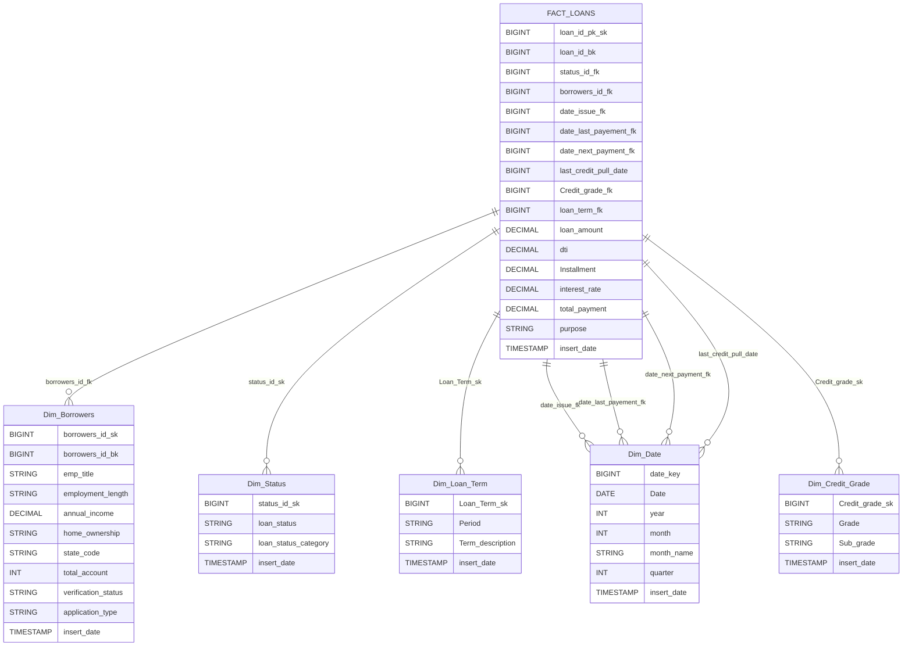

# Loans-Mortgages-ELT-Pipeline

This repository demonstrates a robust ELT (Extract, Load, Transform) data pipeline designed for processing loan and mortgage data. The pipeline showcases integration between several modern data engineering technologies: PostgreSQL, Apache NiFi, HDFS, Apache Hive, Apache Spark, and Apache Airflow. This document provides a comprehensive guide to the pipeline architecture, technology stack, environment setup, and operational workflow.

---

## Table of Contents

- [Overview](#overview)
- [Pipeline Architecture](#architecture)
- [Technology Stack](#technology-stack)
- [Pipeline Workflow](#pipeline-workflow)
- [Setup and Environment](#setup-and-environment)
- [Directory Structure](#directory-structure)
- [How to Run](#how-to-run)
- [Configuration](#configuration)
- [Monitoring & Orchestration](#monitoring--orchestration)
- [Extensibility](#extensibility)
- [Troubleshooting](#troubleshooting)
- [Contributing](#contributing)
- [License](#license)

---


## Overview

This project implements an end-to-end ELT pipeline for the analysis of loans and mortgages data. The pipeline demonstrates how raw data can be extracted from a relational database, loaded into a distributed file system, transformed using big data tools, and finally stored in a data warehouse for advanced querying and analytics.

**Key Features:**
- Automated data ingestion from PostgreSQL
- Scalable data movement via Apache NiFi
- Distributed storage using HDFS
- Data transformation with Apache Spark
- Data warehousing in Apache Hive
- Workflow orchestration and automation using Apache Airflow

---

## Architecture


---

## Dashboard Preview


---

## Technology Stack

| Layer                | Technology          | Role / Purpose                   |
|----------------------|--------------------|----------------------------------|
| Data Source          | PostgreSQL         | Stores raw transactional data    |
| Data Ingestion       | Apache NiFi        | ETL automation, data movement    |
| Storage              | Hadoop HDFS               | Distributed file system          |
| Data Processing      | Apache Spark       | Data transformation (ELT)        |
| Data Warehouse       | Apache Hive        | Structured storage, SQL queries  |
| Orchestration        | Apache Airflow     | Workflow scheduling and monitoring|
| Containerization     | Docker             | Environment isolation            |
| Visualizations       | Metabase           | Visualizing Data Into Useful Insights            |

---


## How to Run

Follow these steps to set up and run the Loans-Mortgages-ELT-Pipeline locally using Docker and Docker Compose. This will provision all required services (PostgreSQL, NiFi, HDFS, Hive, Spark, Airflow, etc.) for development or demonstration.

### Step 1: Clone the Repository

```bash
git clone https://github.com/nasr1231/Loans-Mortgages-ELT-Pipeline.git
cd Loans-Mortgages-ELT-Pipeline
```

### Step 2: Build and Start Docker Services

```bash
docker-compose up -d
```
This command will:
- Download required Docker images (if not present)
- Start containers for all services in the background

### Step 3: Service Availability & Initialization

- Some services (like Airflow and PostgreSQL) may take extra time to initialize.
- Check container health and logs:
  ```bash
  docker ps
  ```
- Wait for the `airflow-init` container to finish initialization before using Airflow UI.
  

### Step 4: Access Tool Web UIs

| Tool/Service  | Default Port | URL                    | Default Credentials           | Notes                    |
|---------------|-------------|------------------------|------------------------------|--------------------------|
| Airflow       |    3000     | http://localhost:3000  | Username: `admin`<br>Password: `admin` | Workflow orchestration   |
| NiFi          |    8085     | http://localhost:8085  | N/A      | Data ingestion flow      |
| Spark Master  |    8080     | http://localhost:8080  | N/A                          | Spark cluster mgmt       |
| Spark Worker  |    8081     | http://localhost:8081  | N/A                          | Spark node status        |
| Zeppelin      |    8082     | http://localhost:8082  | Username: `admin`<br>Password: `admin` (if configured) | Data visualization       |
| HDFS NameNode |    9870     | http://localhost:9870  | N/A                          | HDFS status, browse      |
| PgAdmin    |    5000     | http://localhost:5000  | Username: `pgadmin@admin.com`<br>Password: `admin` | Navigating PostgreSQL DB |
| Metabase |    3001     | http://localhost:3001  | Create Your Own Account    | Data Visualizations |
| PostgreSQL    |    5432     | N/A (use psql/client)  | Username: `user`<br>Password: `user1234` | Used for storing source data |


### Additional: Stop the Project

To stop all containers without removing data:
```bash
docker-compose down
```
- to reset the project and delete volumes
```bash
docker-compose down -v
```

**For more details:**  
> **See the full [docker-compose.yaml](https://github.com/nasr1231/Loans-Mortgages-ELT-Pipeline/blob/main/docker-compose.yaml) for complete details on service configuration.**
---

## Data Ingestion: From Relational Database to HDFS

The initial phase of the pipeline ingests raw data from the PostgreSQL relational database and stages it in HDFS as columnar Parquet files, optimizing storage and downstream analytics.


> **You can upload the NiFi Ingestion Templates by downloading this XML [Template](scripts/Data_Ingestion.xml) and import it into NiFi, then configure the credentials for each processor.**

---

## Configuring the HDFS Staging Layer

Before ingesting data, you need to set up the HDFS directory structure for the pipeline. The **staging layer** is where raw data (Parquet files) is first landed in HDFS for further processing.

### Step-by-Step Setup

1. **Access the Hadoop Shell**

   Open a bash shell in the NameNode container:
   ```bash
   docker exec -it ELT_Loan_namenode bash
   ```

2. **Create the Staging Layer Directory**

   In the container shell, run:
   ```bash
   hdfs dfs -mkdir -p /staging_layer
   ```
   
3. **Set Permissions (Optional but Recommended)**

   Ensure read/write access for required services:
   ```bash
   hdfs dfs -chmod -R 755 /staging_layer
   ```

4. **Verify Directory Creation**

   List the contents to confirm:
   ```bash
   hdfs dfs -ls /
   hdfs dfs -ls /staging_layer
   ```

### Notes

- The `/staging_layer` directory will be the destination for Parquet files written by NiFi during ingestion.
- This setup only needs to be performed once when initializing the environment.

---

## Data Modeling: Fact and Dimension Tables

The pipeline is built using a star schema modeling approach, which organizes loan and mortgage data into fact and dimension tables:

- **Fact Table (`fact_loans`)**:  
  Stores transactional records for loans and mortgages, including details like loan amount, interest rate, applicant, and approval date. Each row represents a single loan/mortgage event.

- **Dimension Tables**:
  - `Dim_Borrowers`: Contains borrower demographic and financial profile information, such as employment, income, home ownership, and application type.
  - `Dim_Credit_Grade`: Defines the credit grade and sub-grade classifications associated with each loan, supporting credit risk analysis.
  - `Dim_Loan_Term`: Describes the term details for loans, including period and term descriptions, enabling product-based segmentation.
  - `Dim_Status`: Categorizes loan statuses (current, late, default, etc.) and status groups for lifecycle and performance reporting.
  - `Dim_Date`: Calendar table providing detailed date breakdowns (year, month, quarter) for time-based analytics, such as loan issuance, payment schedules, and credit pulls.



---

### Notes

- **Surrogate Keys (`_sk`)**: Used for data warehouse uniqueness, independent of source system updates.
- **Business Keys (`_bk`)**: Reference original IDs from the source transactional system.
- **Foreign Keys (`_fk`)**: Maintain relationships between fact and dimension tables.
- **External Tables**: Data is managed outside Hive, making it easier to reload or archive.
- **ORC Format**: Chosen for efficient storage and query performance.
- **Partitioning**: For large tables, consider partitioning by date or status for faster queries.

---

> To Understand more about the Data Model and DDL Script, see: [Hive Data Warehouse DDL Script](scripts/Hive-DWH-DDL.sql)  
