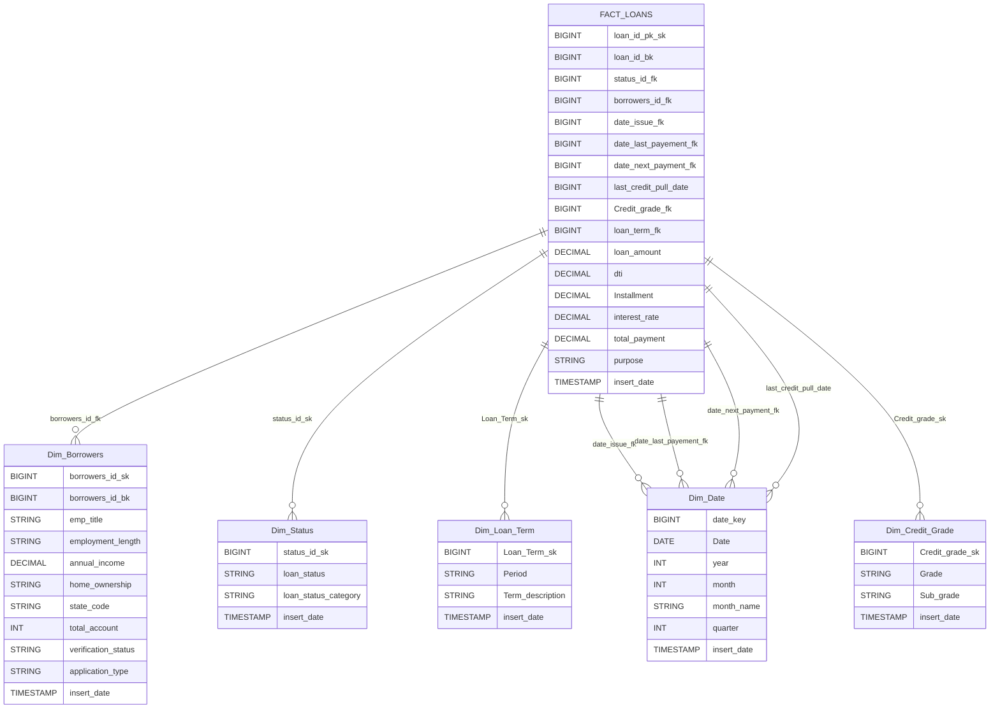

## Data Modeling: Fact and Dimension Tables

The data warehouse is designed using a star schema, optimized for analytical queries on loans and mortgages. This structure separates transactional (fact) data from descriptive (dimension) data, supporting efficient reporting and BI.

### Database Setup

All tables are created as **external Hive tables** using the ORC file format for high performance. The database (schema) is typically named `Loans_DWH` and data is stored in HDFS under `/dwh_financial_loans/external/`.

### Dimension Tables

Dimension tables describe entities related to loans and provide context for analysis:

#### 1. Borrowers Dimension (`Dim_Borrowers`)
| Column                | Type            | Description                         |
|-----------------------|-----------------|-------------------------------------|
| Borrowers_id_sk       | BIGINT          | Surrogate key (DW unique ID)        |
| Borrowers_id_bk       | BIGINT          | Business key (source system ID)     |
| Emp_title             | STRING          | Borrower's job title                |
| Employment_length     | STRING          | Years of employment                 |
| Annual_income         | DECIMAL(12,2)   | Annual income                       |
| Home_ownership        | STRING          | Home ownership status               |
| State_code            | STRING          | US state code                       |
| Total_account         | INT             | Number of financial accounts        |
| Verification_status   | STRING          | Income verification status          |
| Application_type      | STRING          | Type of loan application            |
| insert_date           | TIMESTAMP       | ETL insertion timestamp             |

#### 2. Credit Grade Dimension (`Dim_Credit_Grade`)
| Column          | Type         | Description                    |
|-----------------|--------------|--------------------------------|
| Credit_grade_sk | BIGINT       | Surrogate key                  |
| Grade           | STRING       | Credit grade (A-G)             |
| Sub_grade       | STRING       | Sub-grade (A1, A2, etc.)       |
| insert_date     | TIMESTAMP    | ETL insertion timestamp        |

#### 3. Loan Term Dimension (`Dim_Loan_Term`)
| Column           | Type         | Description                  |
|------------------|--------------|------------------------------|
| Loan_Term_sk     | BIGINT       | Surrogate key                |
| Period           | STRING       | Term period (e.g., 36 months)|
| insert_date      | TIMESTAMP    | ETL insertion timestamp      |
| Term_description | STRING       | Description of the loan term |

#### 4. Status Dimension (`Dim_Status`)
| Column              | Type         | Description                      |
|---------------------|--------------|----------------------------------|
| loan_status         | STRING       | Status of the loan               |
| status_id_sk        | BIGINT       | Surrogate key                    |
| loan_status_category| STRING       | Status category (e.g., Current)  |
| insert_date         | TIMESTAMP    | ETL insertion timestamp          |

#### 5. Date Dimension (`Dim_Date`)
| Column      | Type         | Description                  |
|-------------|--------------|------------------------------|
| date_key    | BIGINT       | Surrogate key (date ID)      |
| Date        | DATE         | Calendar date                |
| year        | INT          | Year                         |
| month       | INT          | Month number                 |
| month_name  | STRING       | Month name                   |
| quarter     | INT          | Quarter number               |
| insert_date | TIMESTAMP    | ETL insertion timestamp      |

---

### Fact Table

#### Fact_Loan

This table records loan transactions and links to all dimension tables:

| Column                | Type             | Description                       |
|-----------------------|------------------|-----------------------------------|
| Loan_id_pk_sk         | BIGINT           | Surrogate key (DW unique ID)      |
| Loan_id_bk            | BIGINT           | Business key (source system ID)   |
| Status_id_fk          | BIGINT           | FK to Dim_Status                  |
| Borrowers_id_fk       | BIGINT           | FK to Dim_Borrowers               |
| Date_key_issue        | BIGINT           | FK to Dim_Date (issue date)       |
| Date_key_last_payment | BIGINT           | FK to Dim_Date (last payment)     |
| Date_key_next_payment | BIGINT           | FK to Dim_Date (next payment)     |
| last_credit_pull_date | BIGINT           | FK to Dim_Date (last credit pull) |
| Credit_grade_fk       | BIGINT           | FK to Dim_Credit_Grade            |
| Loan_Term_fk          | BIGINT           | FK to Dim_Loan_Term               |
| Loan_amount           | DECIMAL(6,2)     | Loan principal                    |
| dti                   | DECIMAL(6,5)     | Debt-to-Income ratio              |
| Installment           | DECIMAL(10,2)    | Monthly installment               |
| Interest_rate         | DECIMAL(5,2)     | Interest rate                     |
| Total_payment         | DECIMAL(10,2)    | Total paid over the loan          |
| purpose               | STRING           | Purpose of loan                   |
| insert_date           | TIMESTAMP        | ETL insertion timestamp           |

All foreign keys in the fact table reference surrogate keys in their respective dimensions.

---

### Star Schema Diagram

---

### Notes

- **Surrogate Keys (`_sk`)**: Used for data warehouse uniqueness, independent of source system updates.
- **Business Keys (`_bk`)**: Reference original IDs from the source transactional system.
- **Foreign Keys (`_fk`)**: Maintain relationships between fact and dimension tables.
- **External Tables**: Data is managed outside Hive, making it easier to reload or archive.
- **ORC Format**: Chosen for efficient storage and query performance.
- **Partitioning**: For large tables, consider partitioning by date or status for faster queries.
